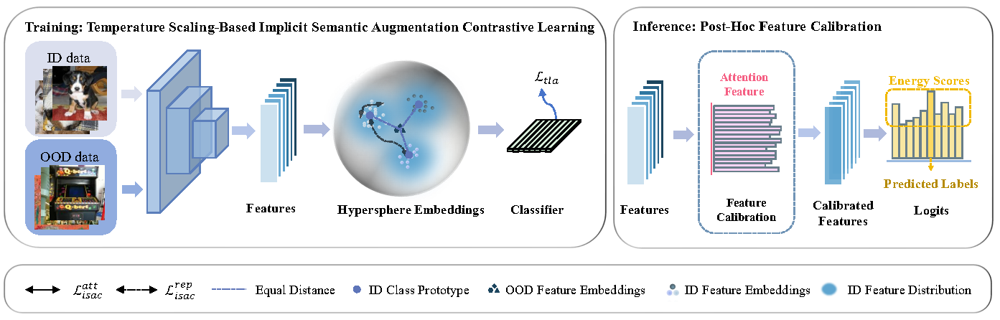

# Long-Tailed Out-of-Distribution Detection: Prioritizing Attention to Tail

This repository is the official implementation of the AAAI25 paper [PATT](https://arxiv.org/abs/2408.06742).

## Overview
<!-- 
<p align="center">
    
</p> -->


Overview of the proposed framework. The framework consists of a temperature scaling-based implicit semantic augmentation training phase and a feature calibration inference phase. We jointly optimize two complementary terms to encourage desirable hypersphere embeddings: an implicit semantic augmentation contrastive loss to encourage a balanced feature encoder and a temperature scaling-based logit adjustment loss to encourage a balanced high-confidence classifier. Feature calibration fine-tunes features during the inference phase by using an attention weight extracted from the training set, thereby achieving desirable ID classification and OOD detection results.

## Rquirements
```
pip install -r requirements.txt
```

## Dataset Preparation

### In-distribution datasets

Please download [CIFAR10](http://www.cs.toronto.edu/~kriz/cifar-10-python.tar.gz), [CIFAR100](http://www.cs.toronto.edu/~kriz/cifar-100-python.tar.gz), and [ImageNet-LT](https://liuziwei7.github.io/projects/LongTail.html) , place them  in`./dataset` 

### Surrogate/Out-of-distribution datasets

For [CIFAR10-LT](http://www.cs.toronto.edu/~kriz/cifar-10-python.tar.gz) and [CIFAR100-LT](http://www.cs.toronto.edu/~kriz/cifar-100-python.tar.gz), please download [TinyImages 300K Random Images](https://people.eecs.berkeley.edu/~hendrycks/300K_random_images.npy) for surrogate OOD and [SC-OOD](https://jingkang50.github.io/projects/scood) for OOD test in `./dataset/Tiny_Images_Dataset` 

For [ImageNet-LT](https://liuziwei7.github.io/projects/LongTail.html), please download [ImageNet10k_eccv2010](https://image-net.org/data/imagenet10k_eccv2010.tar) for surrogate OOD and test OOD 

All datasets follow [PASCL](https://github.com/amazon-science/long-tailed-ood-detection)

## Training

### CIFAR10-LT: 

```
python train.py --gpu 0 --ds cifar10 --Lambda1 0.5 --Lambda2 0.1 --drp <where_you_store_all_your_datasets> --srp <where_to_save_the_ckpt>
```

### CIFAR100-LT:

```
python train.py --gpu 0 --ds cifar100 --Lambda1 0.5 --Lambda2 0.1 --drp <where_you_store_all_your_datasets> --srp <where_to_save_the_ckpt>
```

### ImageNet-LT:

```
python train_imagenet.py --gpu 0,1,2,3 --ds imagenet --md ResNet50 --lr 0.1 --Lambda1 0.02 --Lambda2 0.5 --txtt <txt_path_for_train> --txtv <txt_path_for_val> --iidp <path_for_imagenet1k> --iodp <path for imagenet10k> --srp <where_to_save_the_ckpt>
```

## Testing

### CIFAR10-LT:

```
python test.py --gpu 0 --ds cifar10 --FC True --drp <where_you_store_all_your_datasets> --ckpt_path <where_you_save_the_ckpt>
```

### CIFAR100-LT:

```
python test.py --gpu 0 --ds cifar100 --FC True --drp <where_you_store_all_your_datasets> --ckpt_path <where_you_save_the_ckpt>
```

### ImageNet-LT:

```
python test_imagenet.py --gpu 0 --FC True --txtt <txt_path_for_train> --txtv <txt_path_for_val> --iidp <path_for_imagenet1k> --iodp <path for imagenet10k> --ckpt_path <where_you_save_the_ckpt>
```
## Acknowledgment

Part of our codes are adapted from these repos:

PASCL - https://github.com/amazon-science/long-tailed-ood-detection - Apache-2.0 license

Long-Tailed-Recognition.pytorch - https://github.com/KaihuaTang/Long-Tailed-Recognition.pytorch - GPL-3.0 license

ProCo - https://github.com/LeapLabTHU/ProCo - Apache-2.0 license

## License

This project is licensed under the Apache-2.0 License.

<!-- ## Citation
If you use this package and find it useful, please cite our paper using the following BibTeX. 
 -->


